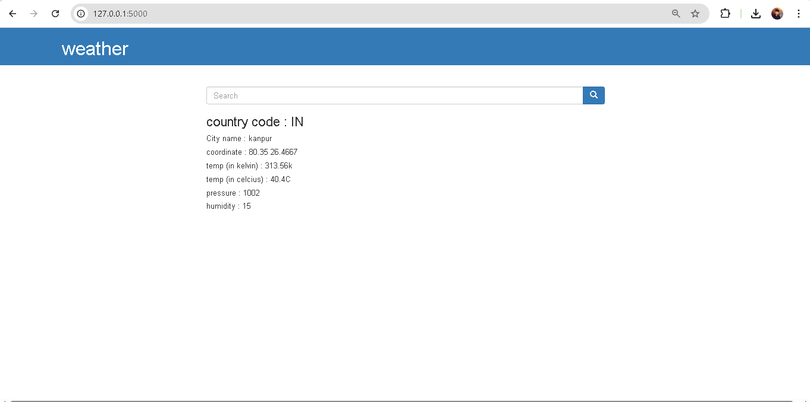

# 🌦️ Weather Flask App

A simple and elegant weather web application built using **Flask**. This app allows users to search for current weather conditions of any city using real-time data from the OpenWeatherMap API.

## 🚀 Features

- Search weather by city name
- Displays:
  - Temperature (in Celsius)
  - Weather condition (e.g., Clear, Rain, etc.)
  - Humidity
  - Wind Speed
  - Country and City name
- Clean and responsive UI using HTML, CSS, and Bootstrap
- Real-time weather data from OpenWeatherMap API

## 🛠️ Tech Stack

- **Backend**: Python, Flask
- **Frontend**: HTML, CSS ,JavaScript
- **API**: OpenWeatherMap

## 📦 Installation

1. **Create a virtual environment (optional but recommended)**
   ```bash
   python -m venv venv
   source venv/bin/activate   # For Linux/Mac
   venv\Scripts\activate      # For Windows
   ```

2. **Install dependencies**
   ```bash
   pip install -r requirements.txt
   ```

3. **Add your OpenWeatherMap API Key**

   Create a `.env` file or update `app.py` with your API key:
   ```python
   API_KEY = "your_openweathermap_api_key"
   ```

4. **Run the app**
   ```bash
   flask run
   ```

5. **Open in browser**
   Visit: `http://127.0.0.1:5000/`

## 🖼️ Screenshots



## Video Link
https://drive.google.com/file/d/1YLk9c4DENDsp2NnZg5V3GbVZHzwctTMi/view?usp=sharing

## 🌐 Deployment

This app can be easily deployed on platforms like **Heroku**, **Render**, or **Vercel** using Docker or gunicorn.

## 📄 License

This project is open source and available under the [MIT License](LICENSE).

## 🙌 Acknowledgements

- [OpenWeatherMap](https://openweathermap.org/) for providing the free weather API.
- Flask documentation and the Python community for continuous support.
